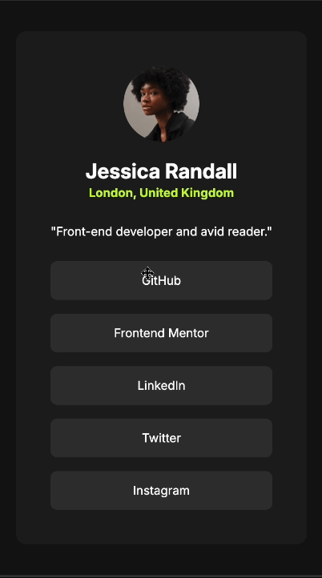

# Frontend Mentor - Social links profile solution

This is a solution to the [Social links profile challenge on Frontend Mentor](https://www.frontendmentor.io/challenges/social-links-profile-UG32l9m6dQ). Frontend Mentor challenges help you improve your coding skills by building realistic projects. 

### The challenge

Users should be able to:

- See hover and focus states for all interactive elements on the page

### Screenshot

| Mobile                                          | Desktop                                  |
| ----------------------------------------------- | ---------------------------------------- |
|  |  |

### Links

- Solution: [Code](/03-Social-links-profile/)
- Live Site:  [Demo](https://kris-lu-dev.github.io/Frontend-Mentor-Challenges/03-Social-links-profile/)
