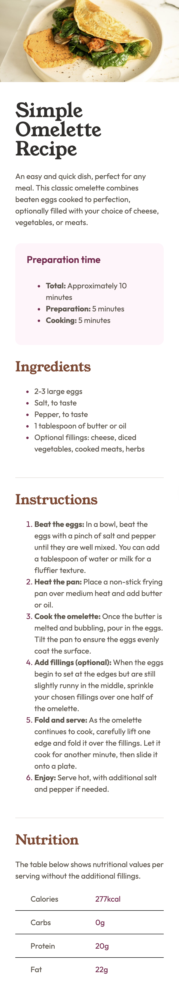
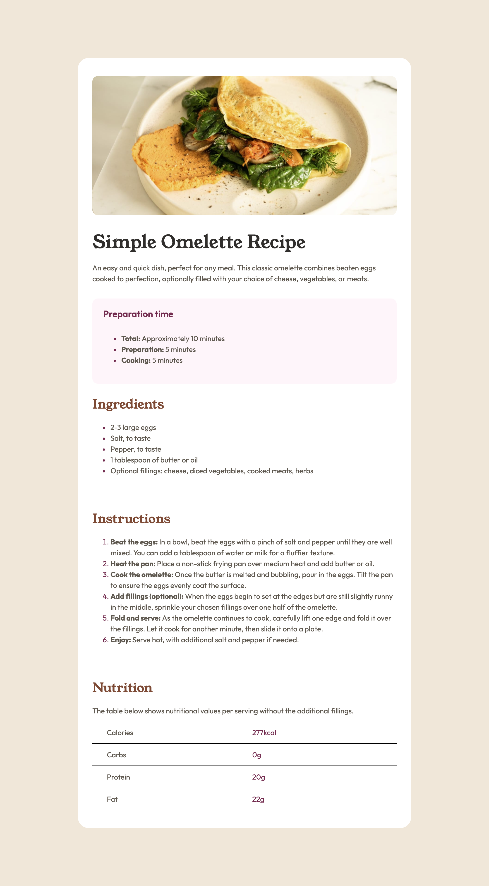

# Frontend Mentor - Recipe page solution

This is a solution to the [Recipe page challenge on Frontend Mentor](https://www.frontendmentor.io/challenges/recipe-page-KiTsR8QQKm). Frontend Mentor challenges help you improve your coding skills by building realistic projects. 

### Screenshot

| Mobile                                          | Desktop                                  |
| ----------------------------------------------- | ---------------------------------------- |
|  |  |

### Links

- Solution: [Code](/04-Recipe-page/)
- Live Site:  [Demo](https://kris-lu-dev.github.io/Frontend-Mentor-Challenges/04-Recipe-page/)
