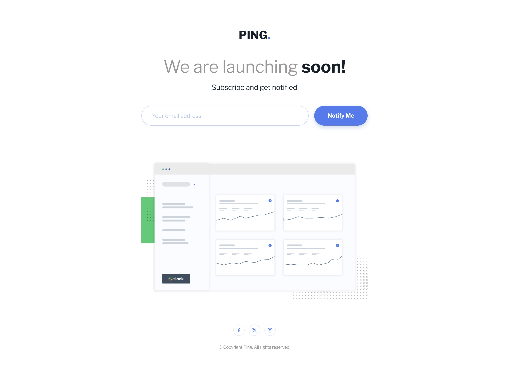

# Frontend Mentor - Ping coming soon page solution

This is a solution to the [Ping coming soon page challenge on Frontend Mentor](https://www.frontendmentor.io/challenges/ping-single-column-coming-soon-page-5cadd051fec04111f7b848da). Frontend Mentor challenges help you improve your coding skills by building realistic projects. 

### The challenge

Users should be able to:

- [x] View the optimal layout for the site depending on their device's screen size
- [x] See hover states for all interactive elements on the page
- [x] Submit their email address using an `input` field
- [x] Receive an error message when the `form` is submitted if:
	- [x] The `input` field is empty. The message for this error should say *"Whoops! It looks like you forgot to add your email"*
	- [x] The email address is not formatted correctly (i.e. a correct email address should have this structure: `name@host.tld`). The message for this error should say *"Please provide a valid email address"*

### Screenshot

| Mobile                                          | Desktop                                  |
| ----------------------------------------------- | ---------------------------------------- |
|  |  |

### Links

- Solution: [Code](/09-Ping-single-column-page/)
- Live Site:  [Demo](https://kris-lu-dev.github.io/Frontend-Mentor-Challenges/09-Ping-single-column-page/)

